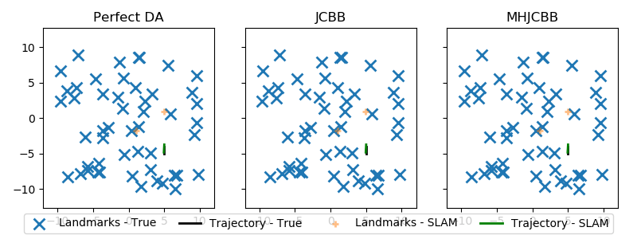
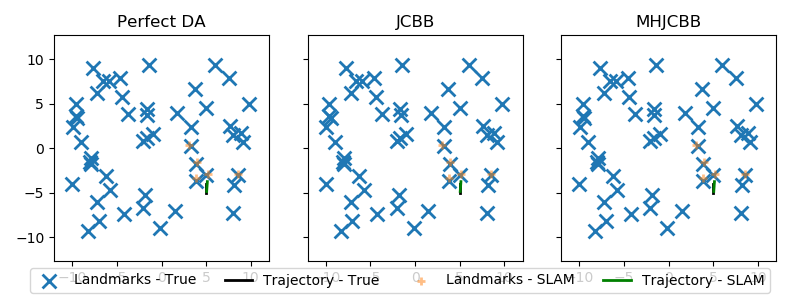
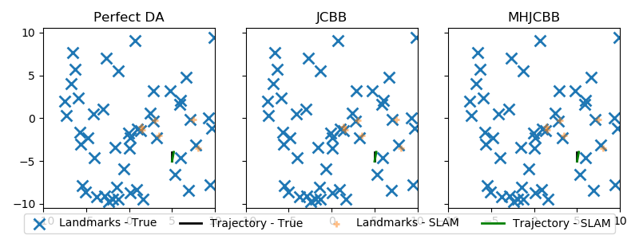
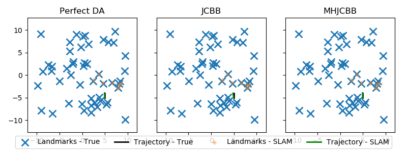

# MHJCBB

Implementation of multiple hypothesis joint compatibility branch and bound (MHJCBB) in [Robust Exploration with Multiple Hypothesis Data Association](http://personal.stevens.edu/~benglot/Wang_Englot_IROS_2018_Preprint.pdf).

 
 

## Installation

Install [da branch](https://bitbucket.org/jinkunw/gtsam/src/f4684fa5798494f46792c8aa829c16bf21ecbac5?at=da) in GTSAM. This will also build [cython wrapper](https://bitbucket.org/jinkunw/gtsam/src/f4684fa5798494f46792c8aa829c16bf21ecbac5/cython/?at=da) of GTSAM, which includes `da_JCBB2` and `da_MHJCBB2`. Modify `PYTHONPATH` to include the GTSAM_CYTHON_INSTALL_PATH (usually `/usr/local/cython`),
```
export PYTHONPATH=$PYTHONPATH:<GTSAM_CYTHON_INSTALL_PATH>
```

## Usage

See [slam.py](./slam.py) for detailed usage.
